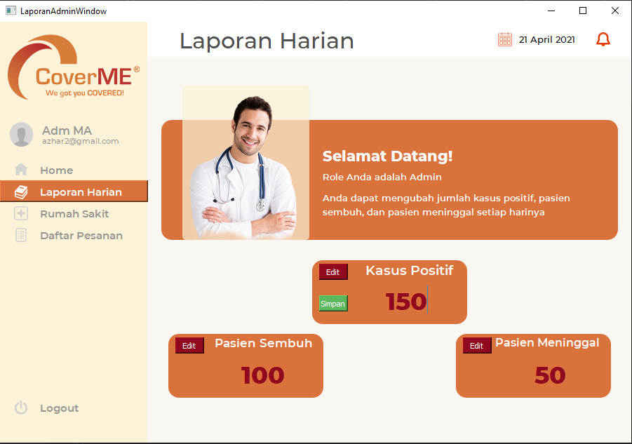
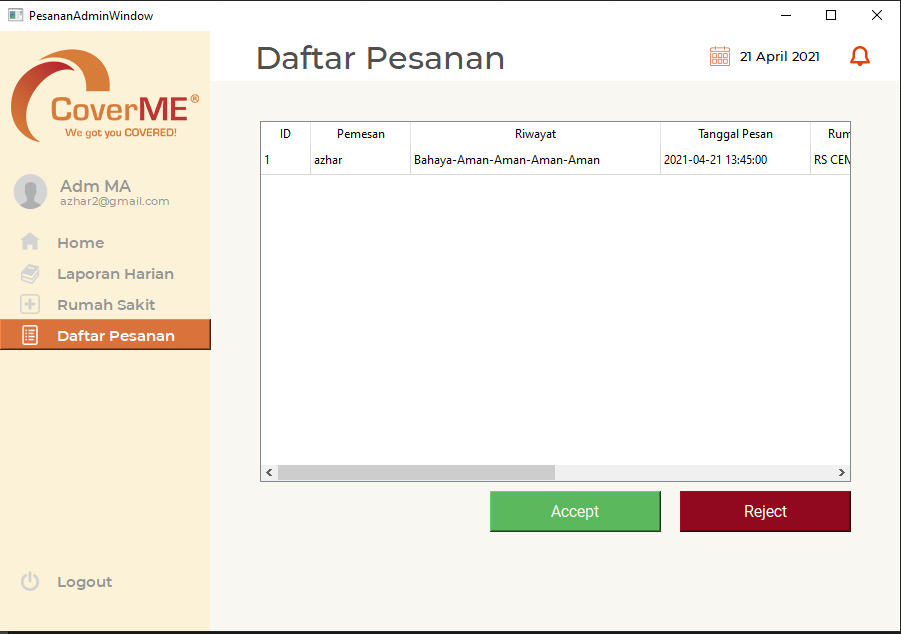
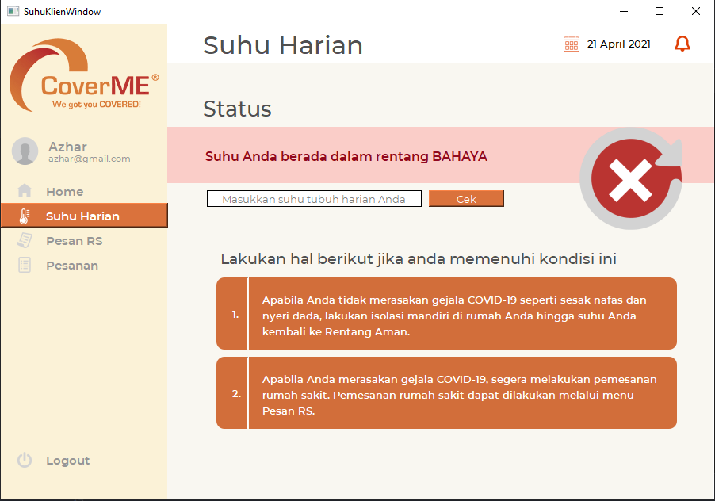

# IF2250-2021-K01-3-CoverMe
Tugas Besar IF2250 - Rekayasa Perangkat Lunak
## Author
- Muhammad Azhar Faturahman (13519020)
- Gde Anantha Priharsena (13519026)
- Reihan Andhika Putra (13519043)
- Kinantan Arya Bagaspati (13519044)

## A. Penjelasan Singkat
Perangkat lunak Cover Me adalah suatu aplikasi berbasis desktop yang berfungsi untuk memesan rumah sakit secara daring. Selain itu, perangkat lunak ini juga dapat menampilkan laporan harian Covid-19 dan juga mendeteksi kesehatan tubuh pengguna berdasarkan suhu tubuhnya. Perangkat lunak ini dibangun menggunakan bahasa pemograman Python dengan library GUI pyqt5
## B. Cara Menjalankan
1. Install server MySQL. Anda juga dapat mendownload MySQL workbench untuk mempermudah melihat isi database. Link download ada di https://dev.mysql.com/downloads/installer/.
2. Install beberapa module python dengan command dibawah Ini
```
pip install pyqt5
pip install pyqt5-tools
pip install mysql-connector-python
pip install pytest
pip install bcrypt
```
3. Clone/Download repository ini 
4. Ubahlah konfigurasi database yang ada di file src/Init_DBData.py. Konfigurasi yang dirubah adalah isi dari hasil return fungsi get_config(). Sesuaikan password, port, dan konfigurasi lainnya sesuai pada saat menginstall server MySQL 
5. Masuk ke directory src dan jalankan command
```
python Login_User.py 
atau
python3 Login_User.py 
```
6. Program akan melakukan refresh database dan mengisi beberapa data dummy setiap kali dirun
7. Jalankan program seperti biasa

## C. Daftar Modul
| No | Nama Modul | Penanggung Jawab |
| -- | ---------- | ---------------- |
| 1. | Login/Register | Muhammad Azhar Faturahman (13519020) |
| 2. | Autentikasi | Muhammad Azhar Faturahman (13519020) |
| 3. | Baca Input | Muhammad Azhar Faturahman (13519020) |
| 4. | Baca Pilihan Menu | Muhammad Azhar Faturahman (13519020) |
| 5. | Daftar Rumah Sakit | Reihan Andhika Putra (13519043) |
| 6. | Baca Data Rumah Sakit Tambahan | Reihan Andhika Putra (13519043) |
| 7. | Tampilkan Data Rumah Sakit | Reihan Andhika Putra (13519043) |
| 8. | Pemilihan Rumah Sakit | Reihan Andhika Putra (13519043) |
| 9. | Laporan Harian Covid | Gde Anantha Priharsena (13519026) |
| 10. | Baca Laporan Harian Covid | Gde Anantha Priharsena (13519026) |
| 11. | Tampilkan Laporan Harian Covid | Gde Anantha Priharsena (13519026) |
| 12. | Pesanan Rumah Sakit | Kinantan Arya Bagaspati (13519044) |
| 13. | Tampilkan Daftar Pesanan | Kinantan Arya Bagaspati (13519044) |
| 14. | Ubah Status Pesanan | Kinantan Arya Bagaspati (13519044) |
| 15. | Tampilkan Detail Pesanan | Kinantan Arya Bagaspati (13519044) |
| 16. | Tampilkan Pesanan Saat Ini | Kinantan Arya Bagaspati (13519044) |
| 17. | Keadaan Pengguna | Gde Anantha Priharsena (13519026) |
| 18. | Baca Suhu Harian Pengguna | Gde Anantha Priharsena (13519026) |
| 19. | Tampilkan Keadaan Pengguna | Gde Anantha Priharsena (13519026) |
### Screen Capture Modul 1 dan 2


### Screen Capture Modul 5, 6, dan 7

### Screen Capture Modul 8

### Screen Capture Modul 9, 10, dan 11


### Screen Capture Modul 12, 13, dan 14


### Screen Capture Modul 15 dan 16


### Screen Capture Modul 17, 18, dan 19



## D. Daftar Tabel Basis Data
### 1. Tabel User
|Key| Attribute | Type |
| --- | --- | --- |
|PK | ID_Pengguna | int |
|   | Nama_Pengguna | varchar(250) |
|   | Username | varchar(100) |
|   | Password | varchar(100) |
|   | Email | varchar(100) |
|   | Alamat | varchar(250) |
|   | Tanggal Lahir | Date |
|   | Nomor Telepon | varchar(50) |
|   | Role | varchar(50) |

### 2. Tabel Klien
|Key| Attribute | Type |
| --- | --- | --- |
|FK | ID_Pengguna | int |
|   | Nama_Pengguna | varchar(250) |
|   | Riwayat | int |
|   | Status Akun | varchar(100) |

### 3. Tabel Rumah Sakit
|Key| Attribute | Type |
| --- | --- | --- |
|PK | ID_RS | int |
|   | Nama_RS | varchar(250) |
|   | Harga_RS | int |
|   | Kapasitas | int |
|   | Jumlah Pasien | int |

### 4. Tabel Pesanan
|Key| Attribute | Type |
| --- | --- | --- |
|PK | ID_Pesanan | int |
|FK | ID_Pengguna | int |
|FK | ID_RS | int |
|   | Tanggal_Pesanan | Datetime |
|   | Status_Pesanan | int |

### 5. Tabel Data Harian Covid-19
|Key| Attribute | Type |
| --- | --- | --- |
|PK | ID_Pesanan | int |
|   | Kasus_Positif | int |
|   | Pasien_Sembuh | int |
|   | Pasien_Meninggal | int |

## Credit 
- http://cover-me.me/
- https://ec.europa.eu/jrc/en/news/coronavirus-pandemic-highlights-vulnerability-migrant-workers-eu
- https://www.iconsdb.com/
- https://pngimg.com/image/15980
- https://rsborromeus.com/gallery-hospital/eb/
- https://unblast.com/free-coronavirus-pandemic-illustration-ai/
- https://colorhunt.co/palette/257985
- https://www.kindpng.com/imgv/iThJmoo_white-gray-circle-avatar-png-transparent-png/
